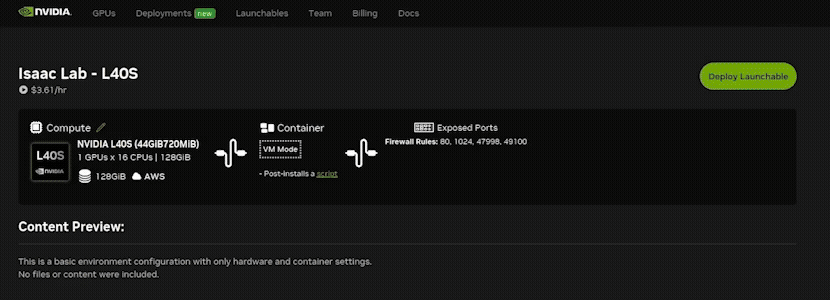

# Isaac Launchable

Isaac Launchable offers a simplified approach to installing and using [Isaac Lab](https://isaac-sim.github.io/IsaacLab/main/index.html) and [Isaac Sim](https://github.com/isaac-sim/IsaacSim).

Through this project, users can interact with Isaac Sim and Isaac Lab purely from a web browser, with one tab running Visual Studio Code for development and command execution, and another tab providing the streamed user interface for Isaac Sim.

Launchables are provided by [NVIDIA Brev](https://developer.nvidia.com/brev), using this repo as a template. Launchables are preconfigured, fully optimized compute and software environments. They allow users to start projects without extensive setup or configuration.

Isaac Lab is built upon Isaac Sim, the NVIDIA simulation framework for robotics. Isaac Sim can both be launched alone, or from the context of Isaac Lab to enable robot learning.

## What this project contains
The installation steps for Isaac Lab are automated via Docker, such that it can be used locally, or be deployed on services such as NVIDIA Brev and run with cloud resources.

The project includes:
- a Visual Studio Code container
- Isaac Lab pre-installed
- Isaac Sim pre-installed
- an Omniverse Kit App Streaming client, based on the [web-viewer-sample](https://github.com/NVIDIA-Omniverse/web-viewer-sample) project.

## Quickstart Guide
This guide will get you started with a Visual Studio Code instance with Isaac Lab preinstalled, and an in-browser user interface provided by Kit App Streaming.

> [!NOTE]
> Please note that Brev instances are pay-by-the hour. To make the best use of credits, stop instances when they are not in use. Stopped instances have a smaller storage charge.

### Deploy
1. Click this Deploy Now button
[](https://brev.nvidia.com/launchable/deploy?launchableID=env-31ezDWyp4LvtDQr5rUhAWOUMFhn)
2. Click the Deploy Launchable button to spin up the instance.
3. Wait for the instance to be fully ready on Brev: running, built, and the setup script has completed (first launch can take a while)
4. On the Brev instance page, scroll to the TCP/UDP ports section.
5. Click the link for port 80 (HTTP) to open Visual Studio Code Server.
6. The default password is `password`. This can be modified.
7. Inside Visual Studio Code, continue with the [README.md](https://github.com/isaac-sim/isaac-launchable/blob/main/isaac-lab/vscode/README.md) instructions. A summary is provided below.
8. Now you're in the Visual Studio Code dev environment! 

### Running Isaac Sim and Isaac Lab - the quick version
In short, the commands to run Isaac Lab and Isaac Sim are similar to workstation installs, except when you need the UI. Then we add a few arguments for streaming to the normal commands.

The top-level README.md file in the dev environment contains a shortened version of the instructions below.


## Detailed Guides

### Running Isaac Sim - Detailed Guide

1. Run the following command: 
```
./isaaclab/_isaac_sim/isaac-sim.sh --no-window --enable omni.kit.livestream.webrtc
```
Note how this is similar to the workstation command for launching Isaac Sim, but uses additional arguments for streaming.

2. Wait for application to be ready. Look for the `app ready` message in the console.
3. Open a new browser tab to view the UI.
4. In this tab, paste the same address as the Visual Studio Code server, changing the end of the URL to: `/viewer`
- Example: if VSCode is at `ec2.something.amazonaws.com`, then the Isaac Sim UI can be accessed at `ec2.something.amazonaws.com/viewer`
5. After a few seconds you should see the UI in the viewer tab. The first launch may take much longer as shaders are cached.
6. On subsequent relaunches, simply refresh this tab to see the UI.


### Running Isaac Lab Commands - Detailed Guide
To run an Isaac Lab command, first consider if it requires the UI. If it doesn't, such as during policy training, simply run the command as normal.

If you need to see the Isaac Sim UI, just append these additional arguments to the Isaac Lab command: `--kit_args="--no-window --enable omni.kit.livestream.webrtc"`.

Let's try out the Ant walking task as a demo. We chose this task because it trains quickly.

1. Run this command to begin headless training without a viewport: 
```
python isaaclab/scripts/reinforcement_learning/skrl/train.py --task=Isaac-Ant-v0 --headless
``` 
This is essentially the same command you would run for a workstation install of Isaac Lab.

2. Once the training script is complete, test the policy behavior by running: 
```
python isaaclab/scripts/reinforcement_learning/skrl/play.py --task=Isaac-Ant-v0 --kit_args="--no-window --enable omni.kit.livestream.webrtc"
``` 
This will launch Isaac Sim. Note how we added the `--kit_args` since we'll want to view the behavior using the Isaac Sim viewport.

3. Wait for application to be ready. 
- Look for a message saying `Simulation App Startup Complete` in the console.

4. Open a new tab in your browser, if you don't have a viewer tab yet.
- Example: if VSCode is hosted at `ec2.something.amazonaws.com`, then the Isaac Sim UI can be accessed at `ec2.something.amazonaws.com/viewer` - note the `/viewer` addition.
> [!NOTE]
> If you already have a viewer tab open, simply refresh it when the app is ready.
5. Wait a few seconds for the stream to start. The first launch may take much longer as shaders are cached.
6. To stop the process, press **CTRL+C** in the terminal.

> [!IMPORTANT]
> This setup is only intended to be used with one viewer instance. Please only keep one viewer tab open at a time for best results.


### Demos
If you're new to Isaac Lab, here are some ideas to try:
- Run the [Showroom Demos](https://isaac-sim.github.io/IsaacLab/main/source/overview/showroom.html) from Isaac Lab.
- Take the introductory Isaac Lab courses: "Train Your First Robot With Isaac Lab" and "Train your Second Robot With Isaac Lab" available [here](https://www.nvidia.com/en-us/learn/learning-path/robotics/)
- Explore the Isaac Lab [Walkthrough](https://isaac-sim.github.io/IsaacLab/main/source/setup/walkthrough/index.html)

## Creating Your Own Launchable

If you'd like a Launchable with more compute, or other custom features, you can fork this repo and / or use this repo but configure a custom Launchable for your projects.

#### Configuring a Custom Brev Launchable

These instructions describe how to create a customized Launchable, similar to the one linked at the beginning of this guide.

1. Log in to the [Brev](https://login.brev.nvidia.com/signin) website.
2. Go to the Launchables category.
3. Click the **Create Launchable** button.
4. Choose the "I don't have any code files" option.
5. Choose **VM Mode - Basic VM with Python installed**, then click Next.
6. On the next page, add a setup script. Under the *Paste Script* tab, add this code:
```bash
#!/bin/bash
git clone https://github.com/isaac-sim/isaac-launchable
cd isaac-launchable/isaac-lab
docker compose up -d
```
7. Click Next.
8. Under "Do you want a Jupyter Notebook experience" select "No, I don't want Jupyter".
9. Select the TCP/UDP ports tab.
10. Expose the following ports (for Visual Studio Code Server and Kit App Streaming). You can choose to limit these ports to be accessible only from certain IPs as well.
```
80
1024
47998
49100
```
11. Click Next.
12. Choose your desired compute.

> [!NOTE]
> GPUs with RT cores are required for Kit App Streaming. 
> The compute specs and driver versions provided also need to be compatible with [Isaac Sim](https://docs.isaacsim.omniverse.nvidia.com/5.0.0/installation/requirements.html). The available drivers are not exposed on this Brev page currently.

> [!IMPORTANT]
> The project is not currently compatible with Crusoe instances. AWS has been tested and is used for the example launchable.
13. Choose disk storage, then click Next.
14. Enter a name, then select **Create Launchable**

Congratulations! You now have a custom launchable.

## Using This Project Locally

This project can also be used to run a containerized version of Isaac Sim and Isaac Lab.

To use this project locally, you'll need a workstation that meets [Isaac Sim](https://docs.isaacsim.omniverse.nvidia.com/5.0.0/installation/requirements.html)'s requirements.


1. Install the NVIDIA Container Toolkit: `sudo install nvidia-container-toolkit`
2. Inside [this docker-compose file](https://github.com/isaac-sim/isaac-launchable/blob/main/isaac-lab/docker-compose.yml), change the `ENV=brev` line to `ENV=localhost`.
3. Inside the folder `isaac-lab`, run `docker compose up -d`.
4. Access the VSCode instance via `localhost`.

## Troubleshooting
If you run into issues or can't make the web viewer connect, the first thing to check is that all containers are running.
If using Brev, view your GPU Instance page and find the command to open a terminal on your instance.
Once you have a terminal to the instance running the containers, run `docker ps` and note if the following containers are running:
- isaac-lab-nginx
- isaac-lab-vscode
- isaac-lab-viewer

To restart the containers:
1. From the terminal connected to your Brev instance, run `docker compose down`
2. Now run `docker compose up -d`
3. Confirm containers mentioned above are all running using `docker ps`


## Licensing Terms

By clicking the "Deploy Launchable" button, you agree to the NVIDIA Isaac Sim Additional Software and Materials License Agreement found here https://www.nvidia.com/en-us/agreements/enterprise-software/isaac-sim-additional-software-and-materials-license/.